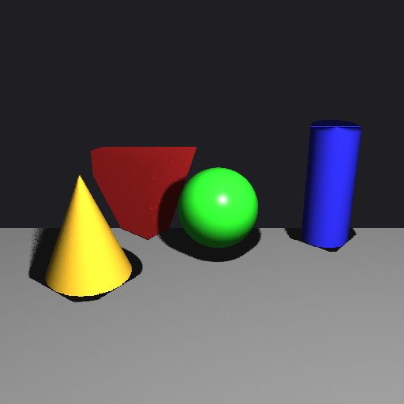

# Grinder
voxel volume type software renderer

The Universal Volume-Dicing Engine
Mission Statement: Grinder is a software renderer designed around a single, 
uncompromising principle: Everything is a Volume. Unlike traditional rasterizers that project triangles or raytracers that trace lines, Grinder treats the view frustum as a solid block of space to [...]\nBy using AABB (Axis-Aligned Bounding Box) subdivision as the universal primitive, Grinder simplifies scene complexity into a unified "search and dice" algorithm.

Core Architectural Goals:
The Universal Primitive: All geometry—from spheres to complex meshes—must implement a simple Intersects(AABB) and Contains(Point) interface.

Lazy Dicing: Geometry is only subdivided ("diced") when it is visible within a screen-space volume, naturally providing Level of Detail (LOD).

Front-to-Back Determinism: The subdivision order naturally handles occlusion, eliminating the need for a traditional Z-buffer.

Tile-Ready: The renderer is built to be "embarrassingly parallel" by dicing the screen into independent work units (Tiles).

